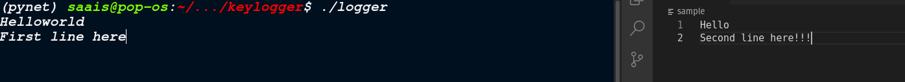
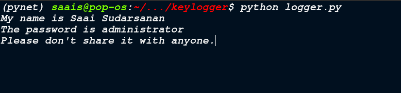
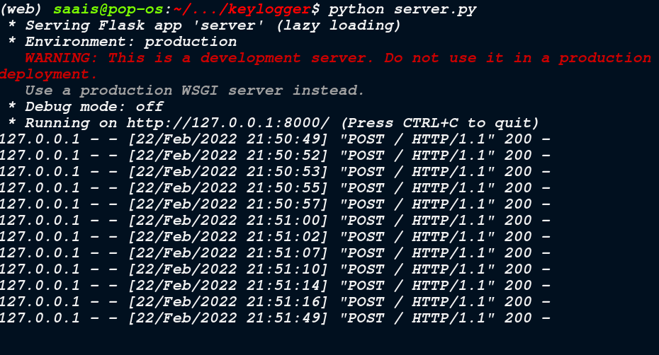
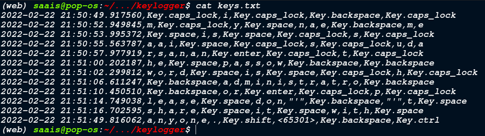
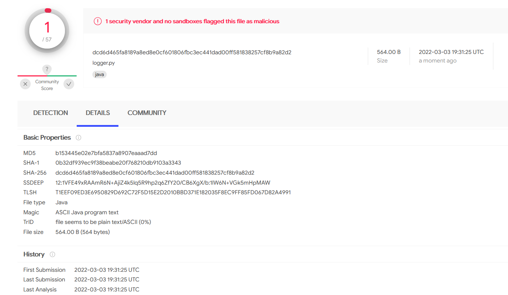

# Keylogger
A python based keylogger that exfiltrates using a post request to a provided URL.
---

# What is a Keylogger and how it works?

* Keystroke logging is the action of recording the keys struck on a keyboard, typically covertly.
* A keylogger can be malicious or not based on its use.
* In the pynput.keyboard we have classes for controlling and monitoring the keyboard.
* The listener joins to the keyboard and we get the keylogger.
* The logger stores the keys in a list and sends a post request with this data to a flask webserver started by the attacker.

# WORKING

The logger captures keystrokes:
<center></center>
<center></center>

The key strokes are sent via a POST to the flask server:
<center></center>

The flask app, records them in a keys.txt file which can be converted into a csv.
<center></center>

<center></center>

# How to setup
```
$ python3 -m venv logr
$ python3 -m venv serv
$ source logr/bin/activate 
(logr) $ pip install -r logger/requirements.txt
(logr) $ python3 logger/logger.py
(logr) $ deactivate
$ source serv/bin/activate
(serv) $ pip install -r server/requirements.txt
(serv) $ python3 server/server.py
```

# Virus Total Report
<center></center>

This project can be made global on configuring the flask app on a heroku webapp.

Link to heroku webapp : https://malserver.herokuapp.com/
