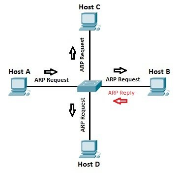

# ARP TOOLS
*Python 3.8*


**ARP Protocol :** ARP is the Address Resolution Protocol, it is used to discover the MAC Address associated with an IP Address in the Link Layer.



**Setting :**
---
HOST A - 192.168.219.74 - 08:00:27:10:51:F3

HOST B - 192.168.219.133 - 08:00:27:10:51:F4
 
HOST C - 192.168.219.124 - 08:00:27:10:51:F5

HOST D - 192.168.219.156 - 08:00:27:10:51:F6

## Normal Operation


* Host A has the IP Address of Host C and to send a packet to that Host, it requires the MAC Address
* Host A sends out an ARP Broadcast, asking **Who is 192.168.219.124?**
* Host B, C and D receive the broadcast, and B and D immediately find out that the packet was not addressed to them, and drop it. Host C replies saying, **192.168.219.124 is at 08:00:27:10:51:F5**
* As soon as Host A receives this reply, it will store it in its ARP-Cache *[maintained by the OS of Host A]*.
* Any data addressed to Host C will be sent to that MAC Address from them on.

## arp-poison.py

**ARP Cache Poisoning deals with corrupting the ARP Cache of the target host, by providing it false data about the MAC Address of the Target**

* Now imagine Host B decides to be poison the ARP-Cache of Host A and steal all the data addressed to Host C.

### Noisy Mode 

**Gratuitous ARP** is an ARP Response without an ARP Request, it can be useful in some cases, but in our case, it is a security risk.

* Host B send a Gratutious ARP response packet to the Host A.
    **192.168.219.124 is at 08:00:27:10:51:F4**
* Host A updates its Cache and now starts sending the data addressed to Host C to Host A until the ARP Cache Lifecycle of Host A comes to and end.

In the tool, I have made it possible to either address it to either one ip (Target only Host A) or send a Gratituos ARP Broadcast, which will poison the ARP Cache of Host D as well.

*Disadvantages :*

* It is easy to detect such activities, and can easily be prevented by turning of the Gratutious ARP mode in devices.

### Stealth Mode
---

* Host B sniffs the network and waits for Host A's to ARP Cache Lifecycle to end and send out a new ARP Request to Host C.
* Host B sends out a reply, by reading the packet's destination and spoofing the packet and sending it before Host C and successfully poisons the ARP Cache of Host A with just one ARP Response and hence avoiding detection.

For this too, you can optionally provide a target or send a response to all the ARP requests that were sniffed.

* Open the packet
* Read its destination
* Craft a packet with source = destination of the packet and destination =  source of the packet and MAC =  your MAC Address

*Disadvantages:*

* Host B's reply must reach Host A before Host C's reply does, else, it is only as good as Gratutious ARP poisoning.
* Waiting Time

### ENVIRONMENT
---
`pip install scapy`

### How it works ? 

**We have to give the following arguements :**

``usage: arp-poison.py [-h] -t  -f  -i  [-S | -d INTERVAL]``

```
  -h, --help            show this help message and exit

  -t , --target_ip      IP Address of the Target/ If in stealth mode, poison will only reply to packets from this IP

  -f , --fake_ip        (Required)IP Address you want to make as the source of this packet

  -i , --interface      (Required)Interface you want to send packets on and sniff on.

  -S, --stealth         Do you want to poison ARP Cache in Stealth Mode? / You can provide a target to poison or just poison all hosts in your LAN

  -d INTERVAL, --interval INTERVAL
                        Packet Interval/Optional in case of Noisy ARP Poisoning
```

## arp-watcher.py

**Logging Tool for ARP Anomaly Detection**

* Logs all the ARP Packets sent and received.
* Logs changes in IP Addresses
* Logs new devices added to the network
