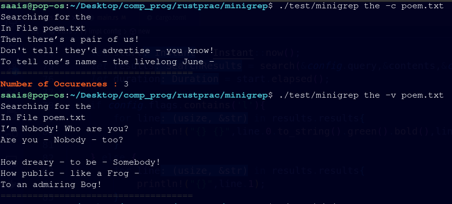
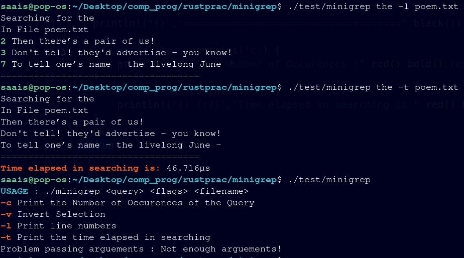

# MINIGREP

A practice project which helped by learn the Rust Programming Language. The language is beautiful and has one of the best compiler I have ever seen. It is kind of difficult to get your head wrapped around the Ownership and Borrow based, memory management model, but, once you get your head wrapped around it, you're good to go.

Keep working on it until you can't get it wrong even when you're dreaming. (Yeah, programmers dream code)

## Minigrep Functionalities
- Count the number of occurences
- Line Numbers
- Timing Searches
- Inverting Selection

## A few images that may help you understand

